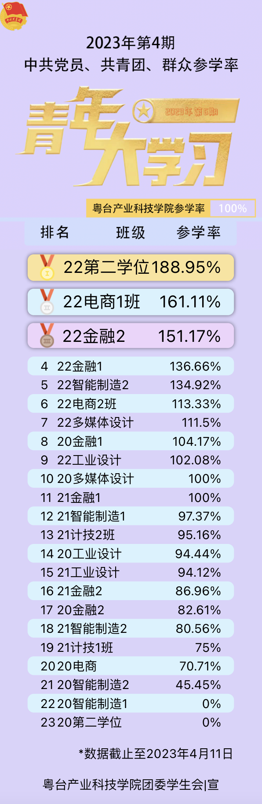

# 青年大学习参学率自动表单
填入数据即可自动排序
```js
const items = [
  ['20金融1', 104.17],
  ['20多媒体设计', 100.00],
  ['20工业设计', 94.44],
  ['20金融2', 82.61],
  ['20电商', 70.71],
  ['20智能制造2', 45.45],
  ['20智能制造1', 0.00],
  ['20第二学位', 0.00],
  ['21金融1', 100.00],
  ['21智能制造1', 97.37],
  ['21工业设计', 94.12],
  ['21计技2班', 95.16],
  ['21计技1班', 75],
  ['21金融2', 86.96],
  ['21智能制造2', 80.56],
  ['22金融2', 151.17],
  ['22金融1', 136.66],
  ['22多媒体设计', 111.50],
  ['22电商2班', 113.33],
  ['22电商1班', 161.11],
  ['22工业设计', 102.08],
  ['22智能制造2', 134.92],
  ['22第二学位', 100.95],
  ['22智能制造1', 114.29],
]
```
